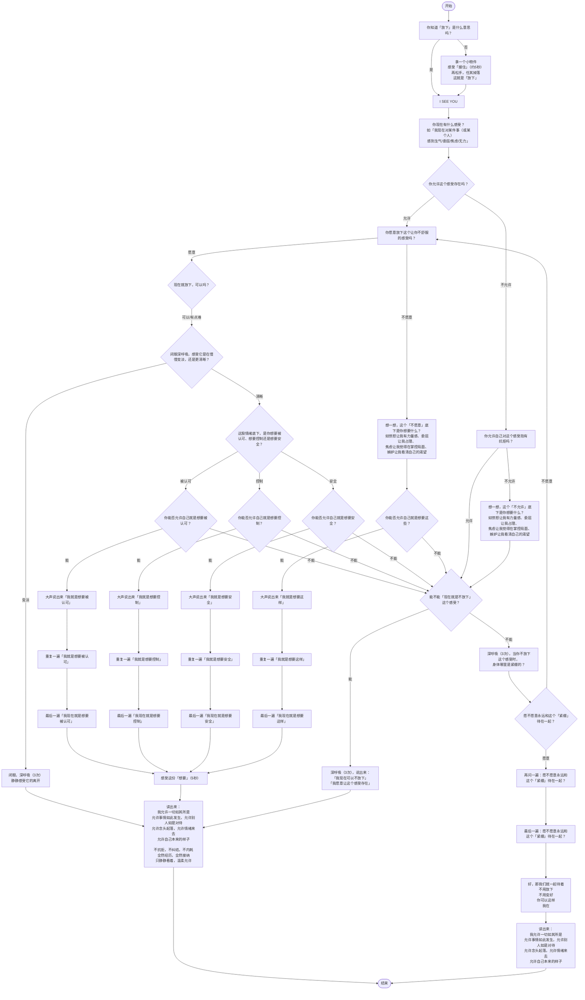

```mermaid
flowchart TD
    START([开始]) --> 0[你知道「放下」是什么意思吗？]
    
    0 -->|是| 1.1[I SEE YOU]
    0 -->|否| 1[拿一个小物件<br/>感受「握住」（约5秒）<br/>再松手，任其掉落<br/>这就是「放下」]
    
    1 --> 1.1
    1.1 --> 2[你现在有什么感受？<br/>如「我现在对某件事（或某个人）<br/>感到生气/委屈/焦虑/无力」]
    
    2 --> 4{你允许这个感受存在吗？}
    
    4 -->|允许| 5[你愿意放下这个让你不舒服的感受吗？]
    4 -->|不允许| 31[你允许自己对这个感受抱有抗拒吗？]
    
    5 -->|愿意| 7{现在就放下，可以吗？}
    5 -->|不愿意| 26[想一想，这个「不愿意」底下是你想要什么？<br/>如愤怒让我有力量感、委屈让我占理、<br/>焦虑让我觉得在掌控局面、嫉妒让我看清自己的渴望]
    
    7 -->|可以/有点难| 8{闭眼深呼吸，感受它是在慢慢变淡，还是更清晰？}
    
    8 -->|变淡| 9[闭眼，深呼吸（3次）<br/>静静感受它的离开]
    8 -->|清晰| 12{这股情绪底下，是你想要被认可、想要控制还是想要安全？}
    
    9 --> 10[读出来：<br/>我允许一切如其所是<br/>允许事情如此发生，允许别人如是对待<br/>允许念头起落，允许情绪来去<br/>允许自己本来的样子<br/><br/>不抗拒，不纠结，不内耗<br/>全然经历，全然接纳<br/>只静静看着，温柔允许]
    10 --> 11([结束])
    
    12 -->|被认可| 13{你能否允许自己就是想要被认可？}
    12 -->|控制| 18{你能否允许自己就是想要控制？}
    12 -->|安全| 22{你能否允许自己就是想要安全？}
    
    13 -->|能| 14[大声说出来「我就是想要被认可」]
    13 -->|不能| 33
    14 --> 15[重复一遍「我就是想要被认可」]
    15 --> 16[最后一遍「我现在就是想要被认可」]
    16 --> 17[感受这份「想要」（5秒）]
    
    18 -->|能| 19[大声说出来「我就是想要控制」]
    18 -->|不能| 33
    19 --> 20[重复一遍「我就是想要控制」]
    20 --> 21[最后一遍「我现在就是想要控制」]
    21 --> 17
    
    22 -->|能| 23[大声说出来「我就是想要安全」]
    22 -->|不能| 33
    23 --> 24[重复一遍「我就是想要安全」]
    24 --> 25[最后一遍「我现在就是想要安全」]
    25 --> 17
    
    17 --> 10
    
    26 --> 27{你能否允许自己就是想要这些？}
    27 -->|能| 28[大声说出来「我就是想要这样」]
    27 -->|不能| 33
    28 --> 29[重复一遍「我就是想要这样」]
    29 --> 30[最后一遍「我现在就是想要这样」]
    30 --> 17
    
    31 -->|允许| 33{能不能「现在就是不放下」这个感受？}
    31 -->|不允许| 32[想一想，这个「不允许」底下是你想要什么？<br/>如愤怒让我有力量感、委屈让我占理、<br/>焦虑让我觉得在掌控局面、嫉妒让我看清自己的渴望]
    
    32 --> 33
    33 -->|能| 34[深呼吸（3次），说出来：<br/>「我现在可以不放下」<br/>「我愿意让这个感受存在」]
    33 -->|不能| 35[深呼吸（3次），当你不放下这个感受时，<br/>身体哪里是紧绷的？]
    
    34 --> 10
    
    35 --> 36{愿不愿意永远和这个「紧绷」待在一起？}
    
    36 -->|愿意| 37[再问一遍：愿不愿意永远和这个「紧绷」待在一起？]
    36 -->|不愿意| 5
    
    37 --> 38[最后一遍：愿不愿意永远和这个「紧绷」待在一起？]
    38 --> 39[好，那我们就一起待着<br/>不用放下<br/>不用变好<br/>你可以这样<br/>我在]
    39 --> 40[读出来：<br/>我允许一切如其所是<br/>允许事情如此发生，允许别人如是对待<br/>允许念头起落，允许情绪来去<br/>允许自己本来的样子]
    40 --> 11
```

